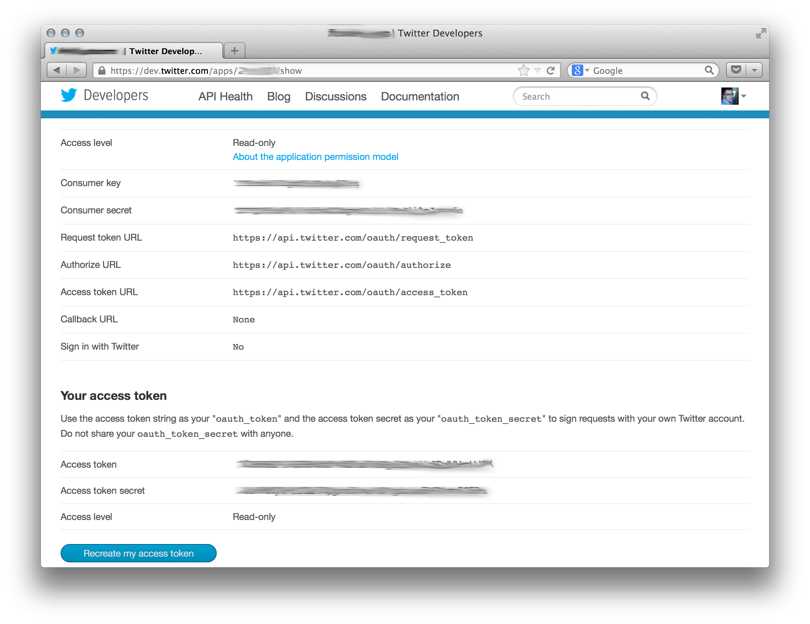

User guide
===========

Installation
------------

You can use virtualenv and pip to install ``poultry``::

    $ virtualenv -ppython2.7 .env
    $ .env/bin/pip install poultry

If you get strange behavior, run `poulry` in the verbose mode by adding the
``-v`` flag to see possible problems.

::

    $ .env/bin/poultry -s twitter://sample group -c poultry.cfg -v
    2013-12-14 12:40:54,922: poultry.stream - WARNING - An http error occurred. Reconnecting...
    Traceback (most recent call last):
      File "/Users/dimazest/Documents/qmul/tools/src/poultry/poultry/stream.py", line 86, in run
        self._run()
      File "/Users/dimazest/Documents/qmul/tools/src/poultry/poultry/stream.py", line 73, in _run
        response.raise_for_status()
      File "/Users/dimazest/Documents/qmul/tools/src/poultry/.env/lib/python2.7/site-packages/requests/models.py", line 765, in raise_for_status
        raise HTTPError(http_error_msg, response=self)
    HTTPError: 401 Client Error: Unauthorized

Local tweet collection management
---------------------------------

It is common to store a collection of tweets in compressed files
grouped by hour. For example::

    $ tree ./tweets
    ./tweets
    ├── 2012-04-19-00.gz
    ├── 2012-04-20-00.gz
    ├── 2012-04-21-00.gz
    ├── 2012-04-21-08.gz
    ├── 2012-04-21-09.gz
    └── 2012-04-21-10.gz

Where each line in the files is the json representation of a
tweet. The first two tweets in my collection look like::

    $ zcat ./tweets/2012-04-19-00.gz | head -n 2
    {"text":"100 days until summer Olympics","id_str":"192764446173708291","coordinates":null,"created_at":"Thu Apr 19 00:00:00 +0000 2012","in_reply_to_status_id_str":null,"favorited":false,"source":"web","in_reply_to_user_id_str":null,"entities":{"urls":[],"user_mentions":[],"hashtags":[]},"contributors":null,"place":null,"in_reply_to_screen_name":null,"in_reply_to_status_id":null,"geo":null,"user":{"is_translator":false,"statuses_count":861,"time_zone":"Quito","profile_background_color":"db4c39","id_str":"395132292","follow_request_sent":null,"verified":false,"profile_background_tile":true,"created_at":"Fri Oct 21 05:40:09 +0000 2011","profile_sidebar_fill_color":"48dbaa","default_profile_image":false,"notifications":null,"friends_count":128,"url":null,"description":"","favourites_count":0,"profile_sidebar_border_color":"e2e83f","followers_count":114,"profile_image_url":"http:\/\/a0.twimg.com\/profile_images\/1807429969\/Spring_2012_009_WarmingFilter_1_normal.jpg","screen_name":"MEL0L407","profile_use_background_image":true,"profile_background_image_url_https":"https:\/\/si0.twimg.com\/profile_background_images\/500309685\/056.JPG","location":"Floridaa","contributors_enabled":false,"lang":"en","geo_enabled":false,"profile_text_color":"0a090a","protected":false,"profile_image_url_https":"https:\/\/si0.twimg.com\/profile_images\/1807429969\/Spring_2012_009_WarmingFilter_1_normal.jpg","listed_count":0,"profile_background_image_url":"http:\/\/a0.twimg.com\/profile_background_images\/500309685\/056.JPG","name":"Melissa Townsend","profile_link_color":"7a0c41","id":395132292,"default_profile":false,"show_all_inline_media":false,"following":null,"utc_offset":-18000},"retweeted":false,"id":192764446173708291,"retweet_count":0,"in_reply_to_user_id":null,"truncated":false}
    {"text":"Maeva et...? #ForeverAlone","id_str":"192764447666864129","coordinates":null,"created_at":"Thu Apr 19 00:00:00 +0000 2012","in_reply_to_status_id_str":null,"favorited":false,"source":"web","in_reply_to_user_id_str":null,"entities":{"urls":[],"user_mentions":[],"hashtags":[{"text":"ForeverAlone","indices":[13,26]}]},"contributors":null,"place":{"bounding_box":{"type":"Polygon","coordinates":[[[2.3894531,48.8832118],[2.4279991,48.8832118],[2.4279991,48.9180446],[2.3894531,48.9180446]]]},"place_type":"city","country":"France","url":"http:\/\/api.twitter.com\/1\/geo\/id\/35d2c646704fa4a1.json","country_code":"FR","attributes":{},"full_name":"Pantin, Seine-Saint-Denis","name":"Pantin","id":"35d2c646704fa4a1"},"in_reply_to_screen_name":null,"in_reply_to_status_id":null,"geo":null,"user":{"is_translator":false,"statuses_count":25433,"time_zone":"Paris","profile_background_color":"C0DEED","id_str":"379912464","follow_request_sent":null,"verified":false,"profile_background_tile":true,"created_at":"Sun Sep 25 19:26:25 +0000 2011","profile_sidebar_fill_color":"DDEEF6","default_profile_image":false,"notifications":null,"friends_count":179,"url":null,"description":"Tu m'as pas encore follow ? #RickRossSurToi !  \r\nMake people laugh, nigga that's my motto\r\n#TeamCuisseDodue #TeamSkinnyNigga","favourites_count":22,"profile_sidebar_border_color":"C0DEED","followers_count":236,"profile_image_url":"http:\/\/a0.twimg.com\/profile_images\/1839059455\/IMG-20120218-00089_normal.jpg","screen_name":"JulianSKEETER","profile_use_background_image":true,"profile_background_image_url_https":"https:\/\/si0.twimg.com\/profile_background_images\/528094149\/Women-Ruined-My-life-shirt.jpg","location":"Rack city","contributors_enabled":false,"lang":"fr","geo_enabled":true,"profile_text_color":"333333","protected":false,"profile_image_url_https":"https:\/\/si0.twimg.com\/profile_images\/1839059455\/IMG-20120218-00089_normal.jpg","listed_count":1,"profile_background_image_url":"http:\/\/a0.twimg.com\/profile_background_images\/528094149\/Women-Ruined-My-life-shirt.jpg","name":"Julian Freemann","profile_link_color":"0084B4","id":379912464,"default_profile":false,"show_all_inline_media":false,"following":null,"utc_offset":3600},"retweeted":false,"id":192764447666864129,"retweet_count":0,"in_reply_to_user_id":null,"truncated":false}

Showing the collection to humans
~~~~~~~~~~~~~~~~~~~~~~~~~~~~~~~~

``poultry show`` is a command which represents the tweets in the human
readable form::

    $ zcat ./tweets/2012-04-19-00.gz | head -n 2 | .env/bin/poultry show
    MEL0L407: 100 days until summer Olympics
    https://twitter.com/#!/MEL0L407/status/192764446173708291
    2012-04-19 00:00:00

    JulianSKEETER: Maeva et...? #ForeverAlone
    https://twitter.com/#!/JulianSKEETER/status/192764447666864129
    2012-04-19 00:00:00

.. note:: ``poultry`` can get data from several sources.

    It cat read the input from the standard input. It also can read tweets from
    files in a directory. ``-s`` option specifies which directory has to be
    processed by ``poultry``. If the source starts with ``twitter://`` then the
    Twitter Streaming API is used, see `Twitter streaming API Stream capturing`_
    for more details.

Another way to get the tweets from the ``./twwets`` is to specify it via the
``-s`` option::

    $ .env/bin/poultry show -s ./tweets
    MEL0L407: 100 days until summer Olympics
    https://twitter.com/#!/MEL0L407/status/192764446173708291
    2012-04-19 00:00:00

    JulianSKEETER: Maeva et...? #ForeverAlone
    https://twitter.com/#!/JulianSKEETER/status/192764447666864129
    2012-04-19 00:00:00

    ... many other tweets from the files in ./tweets ...

Grouping the collection by time
~~~~~~~~~~~~~~~~~~~~~~~~~~~~~~~~

Sometimes it is necessary to group a tweet collection to files by
tweet's creation time. ``poultry group`` groups the tweets (either from
the standard input or from the input directory to chunks which are written to files.

::

    $ .env/bin/poultry group -t 'by_day/%Y-%m-%d.gz' -s ./tweets
    by_day/2012-04-19.gz
    by_day/2012-04-20.gz
    by_day/2012-04-21.gz

``-t`` defines the template. The default template is
``%Y-%m-%d-%H.gz`` which groups the tweets by hour and stores them in
files in the current directory.

Filter the collection
---------------------

It is possible to filter the tweets of interest from the
collection. The tweets can be filtered by three predicates:

  * `follow
    <https://dev.twitter.com/docs/streaming-apis/parameters#follow>`_
    IDs of the users of interest. In the configuration file one ID per line is expected.
  * `track
    <https://dev.twitter.com/docs/streaming-apis/parameters#track>`_
    a list of phrases that a tweet should contain to be filtered. In
    the configuration file one phrase per line is expected.
  * `locations
    <https://dev.twitter.com/docs/streaming-apis/parameters#locations>`_
    a list of longitude, latitude pairs specifying a set of bounding
    boxes to filter tweets by.

An example configuration file ``./poultry.cfg``:

.. code-block:: ini

    # Filter only by one word `work`.
    [filter:work]
    split_template = ./work-%Y-%m-%d.gz
    track = work
    follow =
    locations =

    # Filter tweets with the phrase `visit London`, or
    # which are created by or mention the user with ID `47319664`
    [filter:london]
    split_template = ./london-%Y-%m-%d.gz
    track = visit London
    follow = 47319664
    locations =

    # It is possible to mention several phrases
    [filter:love-like-hate]
    split_template = ./love-like-hate-%Y-%m-%d.gz
    track = love
            like
            hate
    follow =
    locations =

    # The Netherlands are defined as two rectangles.
    [filter:netherlands]
    split_template = ./netherlands-%Y-%m-%d.gz
    track =
    follow =
    locations = 3.734090,51.560411,5.667684,52.493220
                3.821980,51.934515,7.040975,53.687342

The predicates in the filter are ORed, meaning that a tweet to be
filtered has to satisfy at least one predicate.

The directories defined in the ``split_template`` have to exist.

To filter the collection run:

::

    $ .env/bin/poultry filter -c ./poultry.cfg  -s ./tweets

Twitter Streaming API stream capturing
======================================

To get the access to the Twitter Streaming API, you need to create an
application at https://dev.twitter.com/ and obtain ``access_token``,
``access_token_secret``, ``consumer_key`` and ``consumer_secret``. You can get
them from the app dashboard:

and copy to  ``poultry.cfg``:

.. code-block:: ini

    [twitter]
    access_token = ...
    access_token_secret = ...
    consumer_key = ...
    consumer_secret = ...

Accessing the public streams
----------------------------

Twitter provides several `public streams`__. The most interesting are `POST statuses/filter`__ and `GET statuses/sample`__.

__ https://dev.twitter.com/docs/streaming-apis/streams/public
__ https://dev.twitter.com/docs/api/1.1/post/statuses/filter
__ https://dev.twitter.com/docs/api/1.1/get/statuses/sample

POST statuses/filter
~~~~~~~~~~~~~~~~~~~~

Returns public statuses that match one or more filter predicates. The filtering
predicates are defined in the configuration file::

    .env/bin/poultry -s twitter://filter show
    GermaineBling: SJ's manager is like the 16th member of SJ 😃✨
    https://twitter.com/#!/GermaineBling/status/411832441003704321
    2013-12-14 12:18:00

    JASMEENAJ: It's like I am seeing myself in the mirror
    https://twitter.com/#!/JASMEENAJ/status/411832441045655553
    2013-12-14 12:18:00

The best way to collect several streams of tweets is to use the ``filter`` command::

    $ .env/bin/poultry -s twitter://filter filter -c poultry.cfg -v
    ./love-like-hate-2013-12-14.gz
    ./work-2013-12-14.gz
    ./netherlands-2013-12-14.gz

GET statuses/sample
~~~~~~~~~~~~~~~~~~~

Returns a small random sample of all public statuses::

    .env/bin/poultry -s twitter://sample show
    Ferry_Chai: @graciel_11 wkwkwkw sama aja boong --"
    https://twitter.com/#!/Ferry_Chai/status/411833391395266560
    2013-12-14 12:21:46

    Fofoll110: RT @itzGhadh: اللهم إشف مرضى السرطان ، و إرحم من رحلوا عن الدُنيا بسببه ♥
    https://twitter.com/#!/Fofoll110/status/411833391383052288
    2013-12-14 12:21:46

The best way to capture a sample of tweets is to use the ``group`` command::

    $ .env/bin/poultry -s twitter://sample group -c poultry.cfg
    2013-12-14-11.gz
    2013-12-14-12.gz
    2013-12-14-13.gz

Integration with other tools
============================

If you want just to collect tweets and pass their text to your application, you
can use the ``text`` command, which replaces the new line symbol ``\n`` with a
space, so it should be safe assume that you will get one tweet per line::

    $ .env/bin/poultry -s twitter://sample text -c poultry.cfg
    @m1a2n0a1e テキーラはどうですか？
    @ru_tiroru 対戦ありがとうございましたー
    Boleh kok boleh ka"@ekhaasyari: @deidrays dih gaboleh tah?"
    siempre te llevo en mi mente pero ni idea donde estarás

and pipe it's output to your app::

    $ .env/bin/poultry -s twitter://sample text -c poultry.cfg | java TheUltimateTwitterSentimentor
